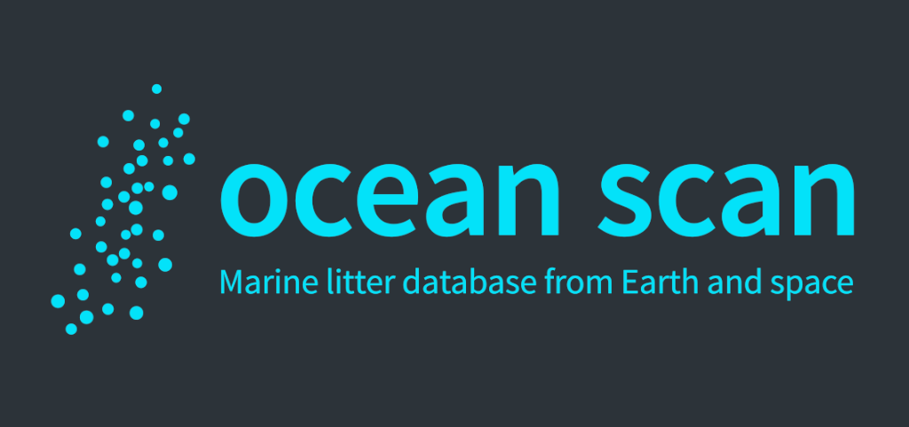

<p align="center">
  
</p>
<h1 align="center">Ocean Scan App</h1>

## Getting started

Make sure you have [Node.js v14.x](https://nodejs.org/en/download/) and [Yarn v1](https://classic.yarnpkg.com/en/docs/install) installed on your system.

### Installing dependencies

```bash
$ yarn install
```

### Running Expo

```bash
$ yarn start
```

### Debugging

You can debug using the standalone [react-native debugger](https://github.com/jhen0409/react-native-debugger) by starting it attached to the right port:

```
open "rndebugger://set-debugger-loc?host=localhost&port=19000"
```

## Understanding the code base

The app source code is located in the `./src` directory.

#### React components - `./src/components`

This is where our React components live.

#### Navigation - `./src/navigation`

This is where all the navigation is defined, we are using `react-navigation`.

#### Screens - `./src/screens`

Screens live here. A screen is a React component which will take up the entire screen and be part of the navigation hierarchy. Each screen will have a directory containing the `.tsx` file, along with any assets or other helper files.

#### Services - `./src/services`

Any services that interface with the outside world will live here (Auth service, APIs, Push Notifications, etc.).

#### Theme - `./src/theme`

Here lives the theme for our app, including spacing, colors, and typography.

#### Utils - `./src/utils`

This is a great place to put miscellaneous helpers and utilities. Things like date helpers, formatters, etc. are often found here.

However, it should only be used for things that are truly shared across the app. If a helper or utility is only used by a specific component or model, consider co-locating it with that component or model.

#### Main entry - `./src/Main.tsx`

This is the entry point to the app. It's the main component which renders the rest of the application.

### Tech stack

- [Yarn v1](https://classic.yarnpkg.com/)
- [TypeScript](https://www.typescriptlang.org/)
- [Expo](https://docs.expo.io/)
- [React Navigation](https://reactnavigation.org/)
- [Redux Toolkit](https://redux-toolkit.js.org/)
